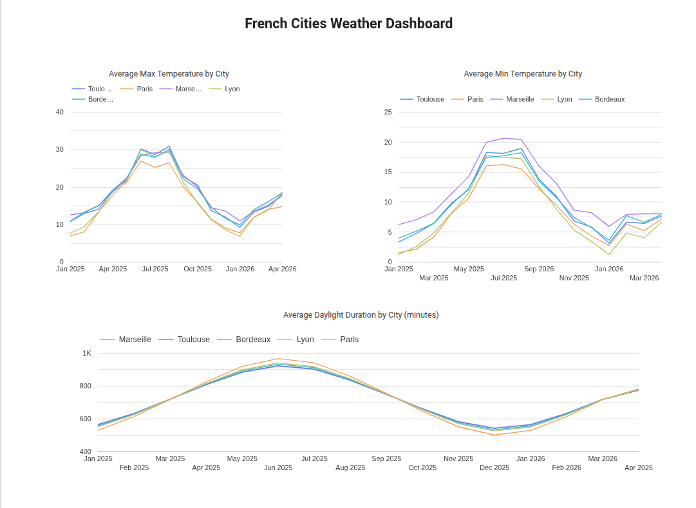

# 🌦️ Weather ETL Pipeline

An end-to-end data engineering project that collects, transforms, and visualizes daily weather data for 5 major French cities using a modern cloud-native stack — fully containerized with Docker.

> 📊 [View Live Dashboard on Looker Studio](https://lookerstudio.google.com/reporting/5aac8b72-7ebf-4564-9f41-96a23d10bf5c/page/0GFuF)



---

## 🏗️ Architecture

```
Open-Meteo API
      │
      ▼
Apache Airflow (DAG: weather_pipeline)
      │
      ├── fetch_city_coordinates   → Geocoding API
      ├── fetch_weather_data       → Historical weather archive
      ├── upload_to_gcs            → Google Cloud Storage (Parquet)
      └── load_to_bigquery         → BigQuery (weather.forecast)
                                            │
                                            ▼
                                    dbt (Transformations)
                                            │
                                    ├── stg_weather           (staging)
                                    └── mart_weather_monthly  (mart)
                                            │
                                            ▼
                                    Looker Studio Dashboard
```

---

## 🛠️ Tech Stack

| Layer | Tool |
|---|---|
| Orchestration | Apache Airflow 2.8 (CeleryExecutor) |
| Data Ingestion | Open-Meteo API (free, no key required) |
| Storage | Google Cloud Storage (Parquet files) |
| Data Warehouse | Google BigQuery |
| Transformation | dbt (BigQuery adapter) |
| Containerization | Docker & Docker Compose |
| Message Broker | Redis |
| Metadata DB | PostgreSQL 15 |
| Visualization | Looker Studio |

---

## 🌍 Cities Monitored

| City | Region |
|---|---|
| Paris | Île-de-France |
| Lyon | Auvergne-Rhône-Alpes |
| Marseille | Provence-Alpes-Côte d'Azur |
| Toulouse | Occitanie |
| Bordeaux | Nouvelle-Aquitaine |

---

## 📦 Project Structure

```
weather-etl-pipeline/
├── dags/
│   └── weather_dag.py              # Airflow DAG definition
├── dbt/
│   ├── models/
│   │   ├── staging/
│   │   │   ├── sources.yml         # Raw BigQuery source definition
│   │   │   ├── schema.yml          # stg_weather data quality tests
│   │   │   └── stg_weather.sql     # Cleans and formats raw data
│   │   └── marts/
│   │       ├── schema.yml          # mart_weather_monthly tests
│   │       └── mart_weather_monthly.sql  # Monthly aggregations per city
│   ├── dbt_project.yml
│   └── profiles.yml                # BigQuery connection profile
├── credentials/
│   └── gcp-credentials.json        # GCP service account key (not committed)
├── Dockerfile
├── docker-compose.yml
└── requirements.txt
```

---

## ⚙️ Data Flow

### Airflow DAG (`weather_pipeline`)

Runs daily and executes four sequential tasks:

1. **`fetch_city_coordinates`** — Calls the Open-Meteo Geocoding API to resolve lat/lon for each city.
2. **`fetch_weather_data`** — Fetches the previous day's weather (max/min temperature, sunrise, sunset) from the Open-Meteo Archive API.
3. **`upload_to_gcs`** — Saves each city's data as a Parquet file to `gs://etl-weather-data/weather/<date>/<city>.parquet`.
4. **`load_to_bigquery`** — Appends the Parquet files into the `weather.forecast` BigQuery table using `WRITE_APPEND`.

### dbt Models

| Model | Type | Description |
|---|---|---|
| `stg_weather` | View | Cleans raw data: casts dates, rounds temperatures, converts UNIX timestamps |
| `mart_weather_monthly` | Table | Monthly avg max/min temperature and avg daylight duration per city |

---

## 🗄️ GCS Storage Layout

```
gs://etl-weather-data/
└── weather/
    └── YYYY-MM-DD/
        ├── Paris.parquet
        ├── Lyon.parquet
        ├── Marseille.parquet
        ├── Toulouse.parquet
        └── Bordeaux.parquet
```

---

## 📐 BigQuery Schema

### `weather.forecast` (raw)

| Column | Type | Description |
|---|---|---|
| `date` | TIMESTAMP | Forecast date |
| `city` | STRING | City name |
| `temperature_2m_max` | FLOAT | Max temperature at 2m (°C) |
| `temperature_2m_min` | FLOAT | Min temperature at 2m (°C) |
| `sunrise` | INTEGER | Sunrise time (UNIX timestamp) |
| `sunset` | INTEGER | Sunset time (UNIX timestamp) |

---

## ✅ Data Quality

12 automated dbt tests across staging and mart layers:

- **`stg_weather`** — `not_null` on all fields (error severity for core fields, warn for sunrise/sunset)
- **`mart_weather_monthly`** — `not_null` on all aggregated fields

---

## 🚀 Getting Started

### Prerequisites

- Docker & Docker Compose
- A GCP project with BigQuery and Cloud Storage enabled
- A GCP service account key with BigQuery and GCS permissions

### Setup

1. **Clone the repository**
   ```bash
   git clone <repo-url>
   cd weather-etl-pipeline
   ```

2. **Add GCP credentials**
   ```bash
   cp /path/to/your/service-account.json credentials/gcp-credentials.json
   ```

3. **Create a `.env` file**
   ```env
   DB_NAME=airflow
   DB_USER=airflow
   DB_PWD=airflow
   AIRFLOW_UID=50000
   ```

4. **Start the stack**
   ```bash
   docker compose up -d
   ```

5. **Access Airflow UI**
   Open [http://localhost:8080](http://localhost:8080) and trigger the `weather_pipeline` DAG.

### Running dbt

```bash
docker compose exec dbt-bigquery dbt run
docker compose exec dbt-bigquery dbt test
```

---

## 📄 License

MIT